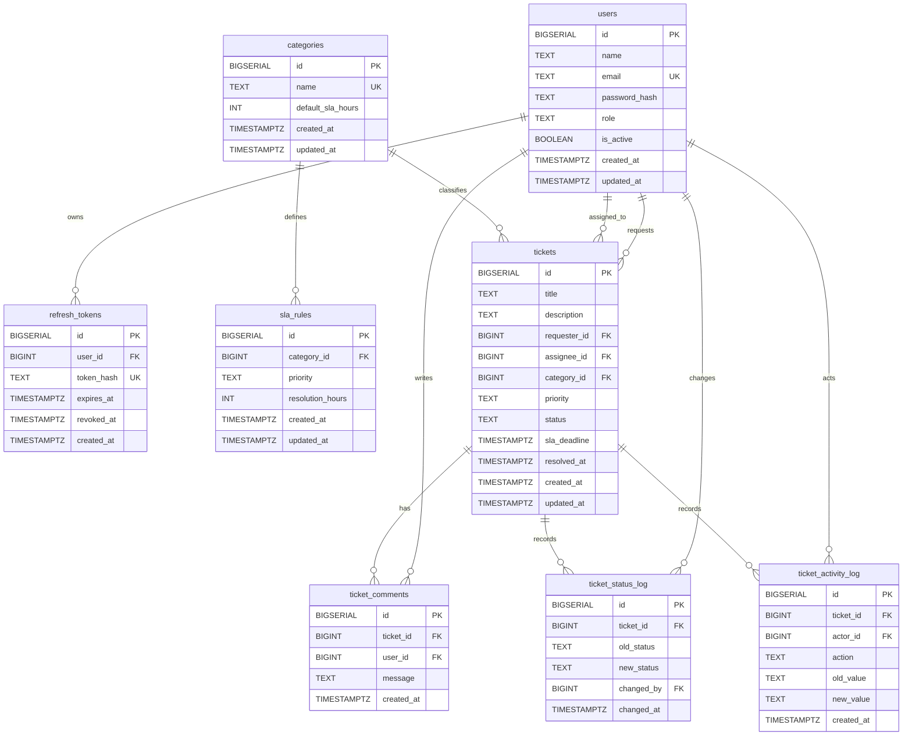

# ERD Helpdesk Ticketing System

Dokumen ini menjelaskan Entity Relationship Diagram berdasarkan schema aktual di `backend/migration/001_init.sql`.

## Diagram



## Relasi Utama

- `users` ke `refresh_tokens`: satu user bisa punya banyak refresh token.
- `users` ke `tickets` sebagai requester: satu user bisa membuat banyak ticket.
- `users` ke `tickets` sebagai assignee: satu staff bisa menerima banyak ticket, tetapi `assignee_id` boleh `NULL`.
- `categories` ke `tickets`: satu category bisa dipakai banyak ticket.
- `categories` ke `sla_rules`: satu category bisa punya banyak SLA rule per priority.
- `tickets` ke `ticket_comments`: satu ticket bisa punya banyak komentar.
- `tickets` ke `ticket_status_log`: satu ticket bisa punya banyak histori perubahan status.
- `tickets` ke `ticket_activity_log`: satu ticket bisa punya banyak aktivitas workflow.

## Constraint Penting

- `users.email` unik.
- `refresh_tokens.token_hash` unik.
- `categories.name` unik.
- `sla_rules` unik untuk kombinasi `(category_id, priority)`.
- `users.role` hanya boleh `super_admin`, `admin`, `staff`, atau `end_user`.
- `tickets.priority` dan `sla_rules.priority` hanya boleh `Low`, `Medium`, `High`, atau `Critical`.
- `tickets.status` hanya boleh `Open`, `In Progress`, `Pending`, `Resolved`, atau `Closed`.
- `ticket_activity_log.action` hanya boleh `ticket_created`, `status_changed`, `assigned`, `reassigned`, atau `comment_added`.

## Catatan Desain

- `refresh_tokens` memakai `ON DELETE CASCADE`, jadi token ikut terhapus jika user dihapus.
- `sla_rules` memakai `ON DELETE CASCADE`, jadi SLA rule ikut terhapus jika category dihapus.
- `ticket_comments`, `ticket_status_log`, dan `ticket_activity_log` memakai `ON DELETE CASCADE` terhadap ticket.
- `tickets.requester_id`, `tickets.assignee_id`, dan `tickets.category_id` tidak memakai cascade delete. Ini menjaga ticket tidak mudah hilang hanya karena user/category berubah.

## Nullable dan Default Value

Kolom yang nullable:

- `refresh_tokens.revoked_at`: `NULL` berarti token belum direvoke.
- `tickets.assignee_id`: `NULL` berarti ticket belum di-assign ke staff.
- `tickets.sla_deadline`: `NULL` berarti deadline belum dihitung atau tidak berlaku.
- `tickets.resolved_at`: `NULL` berarti ticket belum resolved/closed.
- `ticket_status_log.old_status`: `NULL` dipakai untuk status awal saat ticket dibuat.
- `ticket_activity_log.old_value`: `NULL` dipakai ketika tidak ada nilai lama, misalnya `ticket_created`.
- `ticket_activity_log.new_value`: boleh `NULL` jika action tertentu tidak membutuhkan nilai baru.

Kolom dengan default value:

- `users.is_active DEFAULT true`.
- `created_at DEFAULT now()` pada tabel utama dan log.
- `updated_at DEFAULT now()` pada tabel yang bisa berubah seperti `users`, `categories`, `sla_rules`, dan `tickets`.

Catatan:

- Timestamp dibuat oleh database agar konsisten.
- Repository sebaiknya memakai `updated_at=now()` saat update data.
- Field nullable di model Go biasanya direpresentasikan dengan pointer seperti `*time.Time`, `*int64`, atau `*string`.

## Index dan Alasan Performa

Migration membuat index untuk kolom yang sering dipakai sebagai filter, join, atau sort.

Index auth:

- `idx_refresh_tokens_user_id`: mempercepat pencarian token berdasarkan user.
- `idx_refresh_tokens_expires_at`: membantu query/cleanup token expired.

Index ticket list dan dashboard:

- `idx_tickets_requester_id`: mempercepat list ticket milik end user.
- `idx_tickets_assignee_id`: mempercepat list ticket milik staff.
- `idx_tickets_category_id`: mempercepat filter category pada dashboard/report.
- `idx_tickets_status`: mempercepat filter status dan summary dashboard.
- `idx_tickets_created_at`: mempercepat sorting dan filter tanggal.
- `idx_tickets_sla_deadline`: mempercepat pencarian SLA breach.

Index audit dan comment:

- `idx_ticket_comments_ticket_id`: mempercepat load komentar per ticket.
- `idx_ticket_status_log_ticket_id`: mempercepat load histori status per ticket.
- `idx_ticket_activity_log_ticket_id`: mempercepat load aktivitas per ticket.

Catatan:

- Index bukan relasi baru, jadi tidak terlihat langsung di ERD.
- Index tetap penting didokumentasikan karena dashboard/report akan banyak membaca data dengan filter.

## Business Rule yang Tidak Dienforce Database

Beberapa aturan sengaja tidak dipaksa oleh schema database. Aturan seperti ini sebaiknya ditegakkan di service, handler, atau middleware.

Rule role dan akses:

- `tickets.assignee_id` secara domain seharusnya user dengan role `staff`, tetapi database hanya mengecek bahwa ID itu ada di `users`.
- `ticket_comments.user_id` seharusnya hanya user yang punya akses ke ticket, tetapi database hanya mengecek user ada.
- `ticket_status_log.changed_by` seharusnya super admin/admin/staff, tetapi database hanya mengecek user ada.
- `ticket_activity_log.actor_id` seharusnya actor yang sah untuk action tersebut.

Rule workflow:

- Status transition seperti `Open -> In Progress` atau `Resolved -> Closed` tidak dienforce database.
- Permission assign/reassign hanya super admin/admin tidak dienforce database.
- Permission melihat ticket berdasarkan role tidak dienforce database.
- SLA at-risk 20% tidak disimpan sebagai constraint database.

Tempat rule ini seharusnya hidup:

```text
middleware -> auth dan RBAC dasar
handler    -> binding input HTTP
service    -> business rule dan workflow
repository -> SQL, transaksi, dan audit persistence
```

Catatan penting:

- Constraint database tetap berguna sebagai pagar terakhir.
- Business rule tetap perlu di service agar error response dan flow aplikasi bisa dikontrol dengan jelas.

## Entity yang Tidak Masuk ERD

Tidak semua struct Go perlu masuk ERD.

Yang tidak masuk ERD:

- DTO request seperti `LoginRequest`, `RegisterRequest`, `SubmitTicketRequest`.
- DTO response seperti `DashboardSummaryResponse`, `TrendPointResponse`, `MyPerformanceResponse`.
- Row export seperti `ReportExportRow`.
- Filter seperti `DashboardFilter`.

Alasannya:

- Struct tersebut bukan tabel persistent.
- Tidak punya lifecycle database sendiri.
- Bentuknya adalah kontrak API atau hasil query agregasi.

Rule praktis:

```text
Kalau tidak punya tabel sendiri, biasanya tidak masuk ERD.
```

## Gap Potensial untuk V2

Schema saat ini cukup untuk production-ready v1 skala kecil/menengah. Beberapa fitur yang belum ada dan bisa menjadi v2:

- `ticket_attachments`: untuk upload screenshot, PDF, atau file pendukung.
- `departments` atau `teams`: untuk mengelompokkan user dan routing ticket per unit kerja.
- `ticket_watchers`: untuk user yang ingin mengikuti perkembangan ticket tanpa menjadi requester/assignee.
- `ticket_tags`: untuk klasifikasi fleksibel di luar category.
- `notification_logs`: untuk audit email/push notification.
- `password_reset_tokens`: untuk flow lupa password.
- `audit_logs` global: untuk aktivitas admin di luar ticket, misalnya update role user atau perubahan SLA rule.

Catatan:

- Gap ini bukan bug schema saat ini.
- Untuk portofolio v1, lebih baik schema tetap fokus dan bisa dijelaskan dengan kuat.
- Tambahan v2 sebaiknya dibuat setelah auth, ticket workflow, dashboard, report, test, dan dokumentasi dasar stabil.
